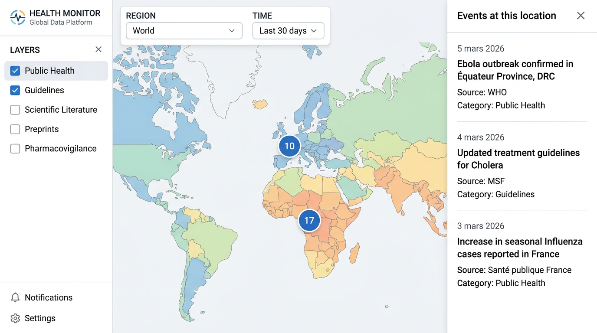
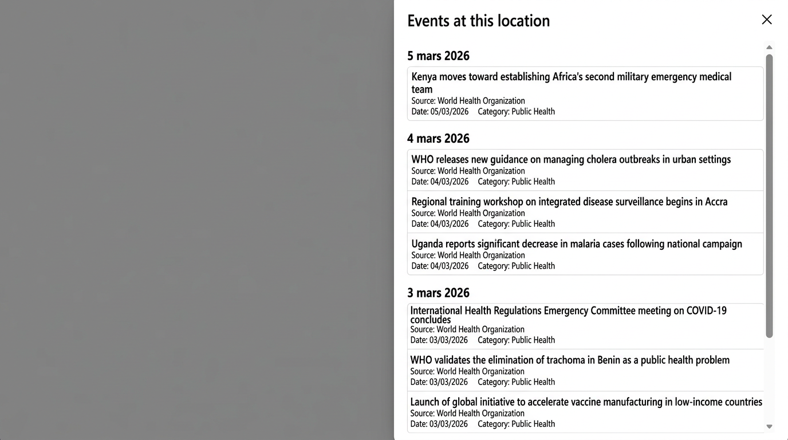

# Health Monitor Dashboard

A prototype dashboard for monitoring global health signals and public health alerts. It aggregates RSS-based news and reports (WHO, ECDC) and displays them on an interactive map.

## Features

- **Interactive map** of health events with zoom and pan
- **Clustering** of signals so multiple events at the same or nearby locations appear as grouped markers
- **Event detail panel** — click a cluster or a single event to see a list or open the event card with title, source, date, and link
- **RSS ingestion pipeline** to fetch, normalize, and promote feed items into events
- **Time filters** — 24h, 7d, 30d — to limit events by publication date

## Current status

This is an **early prototype**, not production-ready. The UI, data coverage, and robustness are suitable for demos and further development only.

## Architecture

- **Frontend:** React + MapLibre GL for the map; Vite, TypeScript, Tailwind
- **Backend API:** FastAPI; serves events, layers, and filters
- **Ingestion pipeline:** RSS fetch and parse (in the API app), event promotion and region fallback; optional Celery worker for async tasks
- **PostgreSQL** (with PostGIS) for events, layers, and raw documents
- **Redis** for Celery broker/backend when using the worker

## Running locally

1. **Start infrastructure (PostgreSQL + Redis):**
   ```bash
   docker compose up -d postgres redis
   ```

2. **Apply migrations and seed the database:**
   ```bash
   make migrate
   make seed
   ```

3. **Run ingestion** (load WHO AFRO and ECDC RSS into events):
   ```bash
   make ingest-who-ecdc
   ```

4. **Start the API:**
   ```bash
   make run-api
   ```
   API runs at `http://localhost:8000`.

5. **Start the frontend:**
   ```bash
   make run-web
   ```
   App runs at `http://localhost:5173`.

You can also run the Celery worker with `make run-worker` if you use task-based ingestion.

## Known limitations

- **Limited sources:** Only WHO AFRO RSS and ECDC RSS are wired; no full WHO/ECDC APIs or other providers yet.
- **Approximate geolocation:** Many events have no precise coordinates and are placed at a regional fallback (e.g. Africa centroid); the map does not imply exact locations for those.
- **Data quality:** Filtering of low-quality or non-article items (e.g. logos, assets) is basic and may let some noise through.

## Screenshots

Images in `docs/screenshots/` are shown below. Use **`dashboard-map.png`** for the map + panel view and **`events-panel.png`** for the events list panel.

| Map and panel | Events panel |
|---------------|--------------|
|  |  |

## License

MIT
